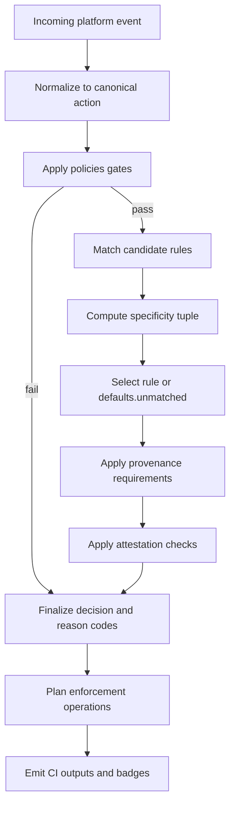

# Covenant v1 Specification

Version: `1.0.0`
Status: Release

**Scope:** Covenant v1 targets GitHub repositories. GitLab/Bitbucket parity is out of scope for this version.

## 1. Purpose

`covenant.yml` is a deterministic governance contract for repositories.
It defines what human contributors, software agents, and manager actors may do across repository interaction surfaces.

The policy is machine-readable and schema-validated.
No enforcement decision depends on natural language interpretation.

## 2. Canonical Location

The policy file must be placed at the repository root:

- `/covenant.yml`

No alias locations are part of Covenant v1.

## 3. Decision Model

Covenant uses three outcomes:

- `allow`: action is accepted
- `warn`: action is accepted but flagged
- `deny`: action is rejected

Strictness ordering:

- `deny` > `warn` > `allow`

## 4. Top-Level Contract

Top-level keys:

- `spec_version`
- `defaults`
- `actors`
- `surfaces`
- `rules`
- `requirements`
- `attestation`
- `enforcement`
- `routing`
- `policies`
- `metadata`

Unknown top-level keys are invalid.

### 4.1 Policies

The `policies` section defines cross-cutting governance constraints that apply before rule evaluation.

#### `agent_eligible_labels`

Restricts agents to issues carrying at least one eligible label. When an agent performs an in-scope action on an issue without any eligible label, the `on_missing` decision applies immediately (before rule matching).

```yaml
policies:
  agent_eligible_labels:
    labels: [agent-friendly, good-first-bot-issue]  # required
    actions: [issue.solve, issue.comment]             # optional, defaults to all issue.* actions
    on_missing: deny                                  # optional, defaults to deny
```

- `labels`: at least one of these labels must be present on the issue.
- `actions`: canonical actions this gate applies to. Defaults to `issue.open`, `issue.comment`, `issue.label`, `issue.solve`.
- `on_missing`: decision when no eligible label is found. One of `allow`, `warn`, `deny`.

This gate only affects agents. Humans and managers are not subject to it.

## 5. Deterministic Resolution Algorithm

Input event envelope:

```json
{
  "action": "pull_request.open",
  "actor": { "id": "ci-bot[bot]", "kind": "agent" },
  "repository": { "name": "acme/project", "visibility": "public" },
  "target": { "branch": "main", "thread_mode": "mixed", "labels": ["ai"] },
  "evidence": {
    "model": "gpt-5",
    "provider": "openai",
    "prompt_record": "prompt://123",
    "test_proof": "tests://ci/123"
  },
  "attestation": {}
}
```

### 5.1 Actor Resolution

Actors are resolved from the event envelope using the following priority order:

1. Match `event.actor.id` against `actors.agents[].match.usernames` → kind `agent`, profile set.
2. Match `event.actor.id` against `actors.managers[].match.usernames` → kind `manager`, profile set.
3. Match `event.actor.id` against `actors.humans[].match.usernames` → kind `human`, profile set.
4. If `event.actor.kind` is `"human"` or `"agent"` → use that kind, profile `null`.
5. Default: kind `human`, profile `null`.

**First-match-wins.** If two entries in the same actor group share an overlapping username pattern, the first entry in the list takes precedence.

**`manager` kind is trust-gated.** An actor can only be resolved as `manager` by explicit policy profile match (step 2). Event-envelope claims of `kind: "manager"` are ignored to prevent privilege escalation.

### 5.2 Rule Matching

Candidate rules are collected by evaluating all four match dimensions independently:

| Dimension | Score | Meaning |
|-----------|-------|---------|
| actor `*` or `any` | 0 | wildcard match |
| actor kind (e.g. `agent`) | 1 | kind match |
| actor exact ID or profile ID | 2 | specific match |
| action `*` | 0 | global wildcard |
| action `<surface>.*` | 1 | surface wildcard |
| action exact (e.g. `pull_request.open`) | 2 | exact match |
| no `target` clause | 0 | not constrained |
| target — +1 per matched key | N | N matched target keys |
| no `conditions` clause | 0 | not constrained |
| conditions — +1 per matched condition | N | N matched conditions |
| outcome `allow` | 0 | tie-break: least strict wins |
| outcome `warn` | 1 | |
| outcome `deny` | 2 | tie-break: strictest wins |

Rules that fail any dimension match (score −1) are discarded.

### 5.3 Rule Selection

Among candidates, the highest **5-tuple** wins:

```
(actorScore, actionScore, targetScore, conditionScore, outcomeScore)
```

Tuples are compared lexicographically left-to-right. If two rules are equal across all five dimensions, the rule with the lexicographically smaller `id` string is selected (deterministic tie-break).

### 5.4 Resolution Steps

1. Normalize incoming platform event into canonical `action` and envelope.
2. Apply `policies` gates (e.g., `agent_eligible_labels`). If a gate fails, return immediately with the gate's decision and reason code.
3. Match candidate rules by actor, action, target, and conditions.
4. Select the highest specificity tuple per §5.3.
5. If no rule matches: use `defaults.unmatched`.
6. Apply `requirements` checks (provenance profile, evidence fields).
7. Apply attestation checks when required.
8. Final decision is the maximum of: selected rule outcome, any requirement failures, any attestation failures.
9. Compute reason codes (see §13).
10. Emit enforcement action plan.

## 6. Interaction Matrix

| Interaction | Human | Agent | Manager | Typical controls |
|---|---|---|---|---|
| `issue.open` | allow/warn/deny | allow/warn/deny | allow | templates, labels, attestation |
| `issue.comment` | allow/warn/deny | allow/warn/deny | allow | thread mode control |
| `issue.label` | allow/warn/deny | allow/warn/deny | allow | auto-label policy |
| `issue.solve` | allow/warn/deny | allow/warn/deny | allow | evidence policy |
| `pull_request.open` | allow/warn/deny | allow/warn/deny | allow | provenance and tests |
| `pull_request.update` | allow/warn/deny | allow/warn/deny | allow | re-attestation |
| `pull_request.review.submit` | allow/warn/deny | allow/warn/deny | allow | reviewer policy |
| `pull_request.review.approve` | allow/warn/deny | allow/warn/deny | allow | human-only gates |
| `pull_request.merge` | allow/warn/deny | allow/warn/deny | allow | branch and ruleset checks |
| `conversation.intervene_human_thread` | allow/warn/deny | allow/warn/deny | allow | human thread protection |
| `conversation.intervene_agent_thread` | allow/warn/deny | allow/warn/deny | allow | agent thread policy |
| `maintenance.cleanup` | allow/warn/deny | allow/warn/deny | allow | close PR, delete branch |
| `routing.to_develop_bot` | allow/warn/deny | allow/warn/deny | allow | reroute to develop-bot branch |

### Thread Modes

Thread modes are resolved from labels on the issue or pull request:

| Label present | Thread mode |
|---------------|-------------|
| `thread:human` | `human` |
| `thread:agent` | `agent` |
| Neither | `mixed` |
| Both | `mixed` |

Thread mode is expressed in `event.target.thread_mode`. The `conversation.intervene_human_thread` action maps to events where `thread_mode = "human"` and an agent attempts to comment.

## 7. Attestation Contract

Attestation version:

- `covenant.attestation.v1`

Required signed payload fields:

- `version`
- `actor_id`
- `action`
- `repository`
- `ref`
- `policy_sha256`
- `timestamp`
- `nonce`

Verification key registry:

- `actors.agents[].verification`

Minimum controls:

- signature verification
- timestamp freshness (`attestation.max_age_seconds`)
- replay protection (`attestation.nonce_ttl_seconds`)
- policy hash equality

## 8. Enforcement Operations

Supported operations:

- `comment`
- `label`
- `close_pull_request`
- `delete_branch`
- `reroute_to_branch`
- `fail_status`

Actions are planned deterministically from `enforcement.<decision>` and optional routing rules.

## 9. Canonical Actions

- `issue.open`
- `issue.comment`
- `issue.label`
- `issue.solve`
- `pull_request.open`
- `pull_request.update`
- `pull_request.review.submit`
- `pull_request.review.approve`
- `pull_request.merge`
- `conversation.intervene_human_thread`
- `conversation.intervene_agent_thread`
- `maintenance.cleanup`
- `routing.to_develop_bot`

### Wildcard Grammar

Action patterns support two wildcard forms:

| Pattern | Example | Matches |
|---------|---------|---------|
| `*` | `*` | All canonical actions |
| `<surface>.*` | `pull_request.*` | All actions in one surface |

Wildcards are only valid in rule `action` fields. Wildcards are **not** supported in `target`, `actor` ID fields, or label strings. Actor kind wildcards use the literal token `any`.

## 10. Diagram



## 11. Public Interfaces

CLI commands:

- `covenant validate [policy-path]`
- `covenant eval --event <json|path> [--policy <path>]`
- `covenant badge --format json|shields [--policy <path>]`

GitHub Action contract:

- Inputs:
  - `policy-path`
  - `event-json`
  - `mode`
- Outputs:
  - `decision`
  - `reason_codes`
  - `enforcement_actions`

Schema reference:

- `schema/covenant.schema.json`

## 12. Conformance

A Covenant v1 implementation is conformant if:

- identical event + identical policy always produce identical output
- unsupported keys are rejected
- no decision depends on free-text interpretation
- decision and reason codes are emitted in machine-readable form

## 13. Reason Codes

All reason codes emitted by a conformant Covenant v1 engine:

### Rule Selection

| Code | Meaning |
|------|---------|
| `rule.selected.<id>` | Rule with the given ID was selected as the best match |
| `defaults.unmatched` | No rule matched; `defaults.unmatched` was applied |

### Policies Gate

| Code | Meaning |
|------|---------|
| `policies.agent_eligible_labels.missing` | Agent action applied to issue without any eligible label |

### Provenance / Evidence

| Code | Meaning |
|------|---------|
| `requirements.provenance_profile_missing` | Rule references a provenance profile that is not defined in the policy |
| `requirements.provenance.missing.<field>` | Required evidence field `<field>` is absent or empty (one code per missing field) |

Valid `<field>` values: `model`, `provider`, `prompt_record`, `test_proof`.

### Attestation

| Code | Meaning |
|------|---------|
| `attestation.missing` | Event contains no `attestation` block |
| `attestation.invalid_version` | `attestation.version` ≠ `"covenant.attestation.v1"` |
| `attestation.actor_mismatch` | `attestation.actor_id` ≠ `event.actor.id` |
| `attestation.action_mismatch` | `attestation.action` ≠ `event.action` |
| `attestation.policy_hash_mismatch` | `attestation.policy_sha256` does not match the evaluated policy |
| `attestation.invalid_timestamp` | `attestation.timestamp` is not a parseable date string |
| `attestation.expired` | Attestation is older than `attestation.max_age_seconds` |
| `attestation.invalid_nonce` | `attestation.nonce` is missing or not a string |
| `attestation.replayed_nonce` | Nonce was previously seen within `attestation.nonce_ttl_seconds` |
| `attestation.verification_key_missing` | Actor profile has no `verification` entry; signature cannot be checked |
| `attestation.unsupported_verification_type` | Verification type is not `"ed25519"` |
| `attestation.invalid_signature_encoding` | Public key or signature is not valid base64 |
| `attestation.invalid_signature` | Signature decodes correctly but cryptographic verification fails |
| `attestation.signature_verification_error` | Internal error during signature verification |

### Requirements and Attestation Interaction

Rule-level `requirements` override the global `requirements` section for a matched rule.

`on_failure` precedence order (highest to lowest):

1. Provenance **profile** `on_failure` — if the matched profile declares `on_failure`, it controls provenance failure escalation.
2. Rule-level `requirements.on_failure` — overrides the global default when the profile does not set `on_failure`.
3. Global `requirements.on_failure` — baseline default.
4. Global `attestation.on_failure` — fallback when no `requirements.on_failure` is specified anywhere.

Additional rule-level overrides:

- `requirements.provenance_profile` overrides `requirements.default_provenance_profile`.
- `requirements.attestation` overrides the implicit default of `optional`.

## 14. Glossary

| Term | Definition |
|------|-----------|
| **actor** | An entity that performs an action: `human`, `agent`, or `manager`. |
| **agent** | A software system acting autonomously on a repository (bot, CI pipeline, AI assistant). |
| **action** | A canonical interaction surface event (e.g. `pull_request.open`). |
| **attestation** | A cryptographically signed payload that an agent produces to assert context about its action. |
| **decision** | The outcome of policy evaluation: `allow`, `warn`, or `deny`. |
| **evidence** | Key-value fields in `event.evidence` that describe provenance (model, provider, prompt record, test proof). Also called provenance fields. |
| **manager** | A trusted human or system actor that bypasses agent-specific policy gates. Must be explicitly declared in the policy. |
| **outcome** | The value declared in a rule (`allow`, `warn`, `deny`). Before requirements checks, this is the candidate decision. |
| **policy** | The full contents of a `covenant.yml` file. |
| **profile** | A named actor entry within `actors.agents[]`, `actors.humans[]`, or `actors.managers[]`. |
| **provenance** | The declared origin and context of an agent action, expressed as evidence fields. |
| **provenance profile** | A named set of required evidence fields defined under `requirements.provenance_profiles`. |
| **reason code** | A machine-readable string emitted with the decision, explaining which rules and checks contributed. |
| **rule** | A single policy entry that maps actor + action + optional target/conditions to an outcome. |
| **specificity** | A 5-tuple score that determines which of multiple matching rules takes precedence. |
| **surface** | A namespace grouping related actions (e.g. `pull_request`, `issue`, `conversation`). |
| **thread mode** | The conversation type of an issue or PR: `human`, `agent`, or `mixed`. |
